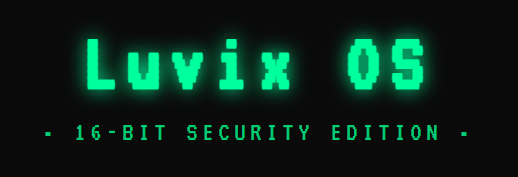
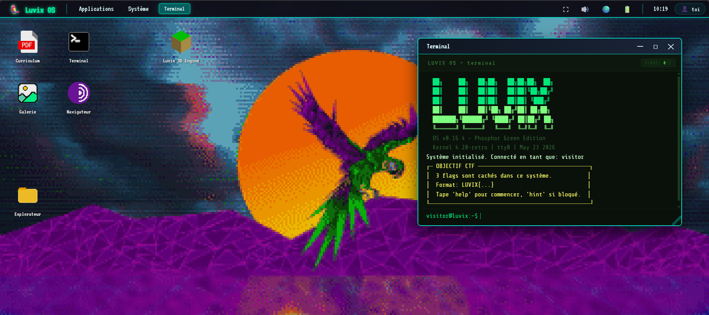

# 🖥️ Luvix OS - 16 bits Edition



> **Une immersion numérique entre nostalgie et modernité.**  
> Luvix OS n’est pas un simple portfolio. C’est un véritable écosystème interactif pensé comme un système d’exploitation rétro. Naviguez à travers mes recherches, explorez mes projets les plus délirants présentés sous forme d’applications, et plongez dans mon univers créatif.
**[🌐 Accéder à l'expérience en ligne](https://lucas-pettinato.fr)**

---

## 🕹️ Le Concept

L'objectif de ce projet est de sortir du cadre classique du "site CV" pour proposer une interface immersive. Chaque projet est traité comme une application native, renforçant l'expérience utilisateur et la narration visuelle.

## ✨ Fonctionnalités & Expérience

* 📟 **Interface Rétro 16-bit** : Design inspiré des systèmes d'exploitation classiques.
* 🚀 **Projets "App-like"** : Chaque travail est présenté comme une application autonome.
* 📂 **Exploration de l'univers** : Navigation non-linéaire pour découvrir CV, travaux et recherches.
* ⚡ **Performance & Légèreté** : Utilisation de technologies natives pour une fluidité maximale.



---

## 🛠️ Stack Technique

**Frontend (Le cœur de l'expérience) :**
* 
* 
* 
* *Note : Développement en Vanilla JS pour un contrôle total sur le DOM et les performances.*

**Infrastructure & Déploiement :**
* **Serveur :** Nginx
* **Conteneurisation :** Docker
* **Hébergement :** OVH Cloud
* **Backend (Local) :** Python (utilisé pour le développement et les tests locaux)

---

## 🧠 Pourquoi avoir choisi le Vanilla JS ?
Bien que je maîtrise les frameworks modernes (React, Vue, Next...), j'ai fait le choix délibéré de ne pas en utiliser pour ce projet pour trois raisons majeures :

1. **Performance extrême** : Zéro surcharge (overhead) de bibliothèque tierce. Le chargement est quasi instantané, ce qui est crucial pour l'expérience "OS".
2. **Contrôle total du DOM** : Pour simuler une interface d'OS 16-bit avec des animations spécifiques et une gestion précise des fenêtres, la manipulation directe du DOM offre une liberté que les abstractions des frameworks peuvent parfois brider.
3. **Légèreté (Zero Dependency)** : Un projet pur, sans dépendances lourdes, respectant la philosophie de légèreté des anciens systèmes d'exploitation.

---

## 🚀 Installation Locale

Pour faire tourner l'environnement de développement sur votre machine :

1. **Cloner le dépôt**
   ```bash
   git clone https://github.com/LuvixTechnologies/PortfolioV0.4.2.git
   cd PortfolioV0.4.2
    ```
2. **Lancer le serveur de développement**
    ```bash
    # Si vous êtes dans le dossier contenant votre script backend
    python app.py
    ```
   
3. Accéder à l'interface 
Ouvrez votre navigateur sur http://127.0.0.1:5000

---

## 👨‍💻 Note de Développement
* **Durée de réalisation** : 3 mois de conception et d'itération.
* **Méthodologie** : Développement assisté par IA pour l'optimisation du code et la résolution de bugs complexes, permettant de se concentrer sur l'architecture et l'expérience utilisateur.

---

## 👤 Contact
* **Nom** : Lucas Pettinato
* **Site Web** : lucas-pettinato.fr
* **GitHub** : @LuvixTechnologies
* **LinkedIn** : **[Lucas PETTINATO](https://www.linkedin.com/in/lucas-pettinato-b9439922b/)** 
